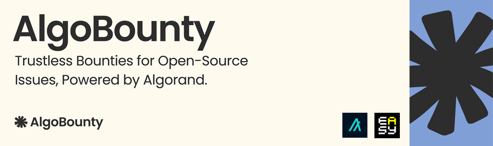

# AlgoBounty: Trustless Open-Source Bounties on Algorand

AlgoBounty is my individual hackathon project submission for the EasyA x Algorand Hackathon London 2025 that empowers open-source maintainers to attach trustless, verifiable bounties to their GitHub issues, leveraging Algorand's blockchain for escrowed payments.

## 🏆 Awards

- **2nd Place Winner** - Pitching Track at EasyA x Algorand Hackathon London 2025

## Features

- **Trustless Escrow**: All bounty payments are held in Algorand smart contracts
- **Verifiable Execution**: Transparent and auditable payout distribution
- **Fast, Low-Fee Transactions**: Built on Algorand's efficient blockchain
- **Verifiable Onchain Connections**: Secure connections between GitHub accounts and crypto wallets
- **GitHub App Integration**: Seamless integration with GitHub issues and pull requests

## Architecture

This project consists of three main components:

1. **Smart Contracts** (`/projects/algo-bounty-contracts/`)
   - IssueEscrow contract for holding USDC bounties
   - Written in Python using Algopy framework

2. **Frontend** (`/projects/algo-bounty-frontend/`)
   - Next.js application with TypeScript
   - Wallet integration (Pera, Defly)
   - Bounty management interface

3. **Backend API** (Next.js API routes)
   - GitHub webhook handlers
   - Bounty management endpoints
   - Smart contract interaction

## 🛠️ Setup Instructions

### Prerequisites

- Node.js 20+ and npm 9+
- Python 3.12 and Poetry
- AlgoKit CLI 2.0.0+
- Docker (for LocalNet)

### 1. Install Dependencies

```bash
# Bootstrap the project
algokit project bootstrap all
```

### 2. Start LocalNet

```bash
# Start Algorand LocalNet
algokit localnet start

# Verify LocalNet is running
algokit localnet status

# Open Lora Explorer
algokit localnet explorer
```

### 3. Deploy Smart Contracts

```bash
cd projects/algo-bounty-contracts

# Deploy the IssueEscrow contract
algokit project deploy localnet
```

### 4. Start the Frontend

```bash
cd projects/algo-bounty-frontend

# Copy the environment configuration
cp .env.example .env

# Start the development server
npm run dev
```

The application will be available at `http://localhost:3000`.

## Configuration

### Environment Variables

Create a `.env` file in the frontend directory and set the environment variables.

## Usage

### Creating a Bounty

1. Open the AlgoBounty application
2. Add the GitHub app via the "Add GitHub App" button
3. Select the repository you want to create a bounty for
4. Now whenever a new issue is created in the repository, a bounty will be created for it and the link to the bounty will be added to the issue description.
5. Contributors can now contribute to the bounty by funding it.
6. Once the bounty is funded, the maintainer can distribute the bounty to the contributors.

## 🔍 Smart Contract Details

### IssueEscrow Contract

The main smart contract handles:

- **create_bounty()**: Initialize escrow for a GitHub issue
- **fund_bounty()**: Add USDC to existing bounty
- **distribute_payout()**: Release funds to contributors
- **mark_resolved()**: Mark issue as resolved
- **refund()**: Return funds to maintainer
- **get_bounty_info()**: Get current bounty information

### State Schema

- `issue_id`: GitHub issue identifier
- `total_bounty`: Total USDC amount in escrow
- `usdc_asset`: USDC asset reference
- `maintainer`: Repository maintainer address
- `is_resolved`: Resolution status

### GitHub Linker Contract

The GitHub Linker contract is used to link GitHub accounts to Algorand addresses.

- **link_github_account()**: Link a GitHub account to an Algorand address
- **get_github_link()**: Get the Algorand address linked to a GitHub account

### State Schema


- `github_id`: GitHub account identifier
- `algorand_address`: Algorand address
- `expiry`: Expiry timestamp
- `nonce`: Nonce
- `attestor_pubkey`: Attestor public key
- `signature`: Signature

## 🧪 Testing

### LocalNet Testing

```bash
# Start LocalNet
algokit localnet start

# Run contract tests
cd projects/algo-bounty-contracts
poetry run pytest

# Test frontend
cd projects/algo-bounty-frontend
npm run test
```

### Lora Explorer

Access the Lora explorer at `http://localhost:3001` to view transactions and contract interactions.

## 🚀 Deployment

### LocalNet (Development)

The current setup is only configured for LocalNet development. Testnet and Mainnet deployments are not supported yet.

## 📄 License

This project is licensed under the MIT License.

---

**Note**: This is a hackathon project and should be thoroughly tested before any production use.
